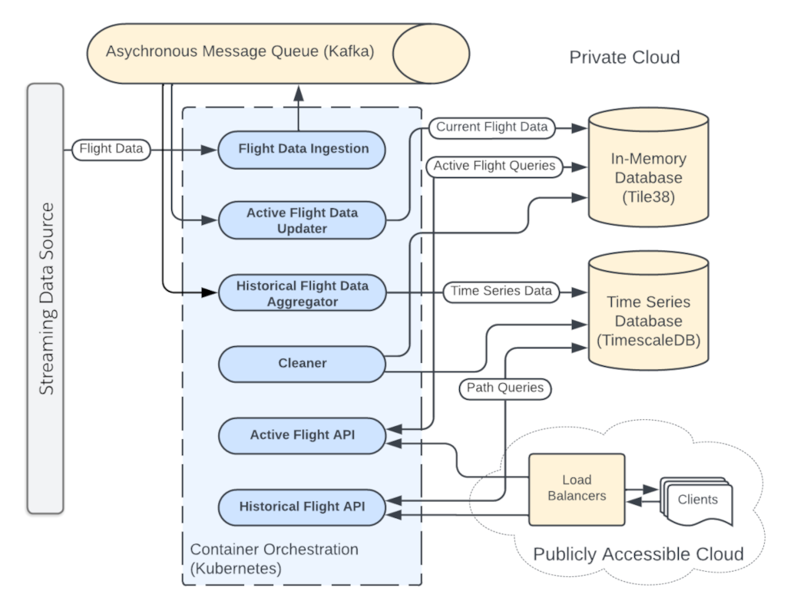

# 2. **System Design**

The data flow diagram below displays the major system components as well as the data flow between them. Here we will discuss the functions of these components, paying special attention to the particular strengths of each that make it particularly suitable for this application's feature set. Later sections of this document will focus on the specific details of each feature, including the models and protocols involved, as well as other important architectural considerations of each component. 



## Message Queue / Data Pipeline 

Since we are acquiring flight data from a source in a piecemeal fashion (one message per aircraft) at a rate of one message every 5 seconds, we need a way of collecting these messages into an asynchronous processing queue. Flight data which is continuously updated from numerous sources can be unpredictable and we will require low-latency storage or caching on the query side. Any problems with data transformations or database connectivity could cause a loss of data, therefore, it would be advantageous to decouple the data ingestion process from any downstream system, and allow us to buffer the data asynchronously.  [Apache Kakfa](./6.technologies-and-tools.md#apache-kafka) is specifically designed for this purpose. Ingesting flight data into [Apache Kakfa](./6.technologies-and-tools.md#apache-kafka) before transforming and feeding it into other data storage solutions is important because Kafka provides a scalable and fault-tolerant system for handling data streams. By using Kafka as an intermediary, as we can manage the data processing from source separately and effectively cache that data for a limited time in the pipeline. Downstream processes can be restarted and network connectivity can be restored and we can resume processing data without loss.  

### Key Partitioning 

[Apache Kakfa](./6.technologies-and-tools.md#apache-kafka) is a pubish/subsribe system with *topics* that represent logical channels that organize and categorize messages (or records). Each topic acts as a feed to which producers send data and from which consumers read data. To ensure scalability and efficient parallel processing, Kafka topics are divided into *partitions*. Partitions are essentially ordered, immutable sequences of records, where each record is assigned an offset (a non-monitomically increasing integer) as it is published. Kafka stores partitions across multiple servers in a Kafka cluster, enabling parallel reads and writes, distributing the workload, and ensuring fault tolerance. Partitions allow Kafka to achieve horizontal scalability, as multiple consumers in assigned groups can read from different partitions, enabling distributed processing of large data streams.

Choosing a partition key in Kafka is important because not only does it determine how records are distributed across partitions, directly affecting data locality, load balancing, and performance, but also because Kafka can guarantee that messages are ordered within that partition. A well-chosen partition key ensures that related data is consistently sent to the same partition and can therefore be read in consistent order. For this application it is critical that use the `flight_id` as the partition key so that we can ensure that we are always receiving the most recent update for that flight (note: Kafka can only provide this guarantee for the timestamp in which messages are published to Kafka, NOT for any timestamp that may be contained in a message).

### Message Schema

Why did we choose protobuf?


```proto
syntax = "proto3";

message FlightData {
  // Unique flight identifier
  string flight_id = 1;

  // Geospatial location data (latitude, longitude)
  Location location = 2;

  // Altitude in feet
  int32 altitude = 3;

  // Airspeed in knots
  int32 airspeed = 4;

  // Timestamp in ISO 8601 format or UNIX epoch time
  string timestamp = 5;

  // Metadata: airline, flight number, departure and arrival airports
  FlightMetadata metadata = 6;
}

// Location schema (latitude, longitude)
message Location {
  double latitude = 1;
  double longitude = 2;
}

// Metadata schema: additional flight details
message FlightMetadata {
  string airline = 1;
  string flight_number = 2;
  string departure_airport = 3;
  string arrival_airport = 4;
}
```

### **Explanation of the Protobuf Fields:**

1. **FlightData**:
   - Contains the main flight data, such as the flight ID, location, altitude, airspeed, timestamp, and metadata (airline, flight number, departure, and arrival airports).

2. **Location**:
   - Stores the latitude and longitude of the aircraft.

3. **Metadata**:
   - Holds additional flight information like the airline name, flight number, and the codes for the departure and arrival airports.

### **Field Descriptions**:
- `flight_id`: A unique identifier for each flight.
- `location`: A nested message containing the `latitude` and `longitude` of the aircraft.
- `altitude`: The current altitude of the aircraft in feet.
- `airspeed`: The current airspeed of the aircraft in knots.
- `timestamp`: The time when the position and data were recorded, represented as a string (ISO 8601 format or UNIX timestamp).
- `metadata`: A nested message containing flight-related information such as the airline, flight number, and airports (departure and arrival).

This schema is lightweight and can efficiently represent and transfer the flight data across systems using Protobuf serialization.

Describe message format schema format 

The data schema for flight data should capture the essential attributes of each flight, including its metadata, real-time position, and flight metrics (e.g., altitude and speed). The schema must be flexible to accommodate frequent updates and ensure that the data is structured for efficient processing, querying, and storage in systems like Kafka, Elasticsearch, or time-series databases.


### **Key Design Considerations:**

- **Real-time updates**: Since flight data is dynamic, the `position` and `status` fields will likely update frequently. This structure allows for easily updating the position data with each new reading (e.g., every 5 seconds).
- **Temporal data**: The `timestamp` field in the `position` object captures when the position data was recorded. This is critical for tracking the flight's progression over time.
- **Flexible storage**: The schema is flexible enough to be stored in a variety of systems (Kafka, Elasticsearch, Redis, etc.), and can be enriched or augmented as needed (e.g., adding additional fields for analytics).

### **Partitioning in Kafka:**
In Kafka, you might partition the data using the **flight_id** or **airline** so that all updates for the same flight are processed sequentially, ensuring that real-time position updates for each flight maintain consistency.

### **Schema Evolution:**
This schema can be extended with more fields or attributes (e.g., adding in-flight entertainment data or cabin conditions) as needed without breaking existing processes. This flexibility is key to handling future data requirements or integrating additional data sources.


Describe how general flight message data is ingested into kafka pipeline


### **Kafka Topic Configuration**:
Ensure that the Kafka topic (`flights-topic`) is created and configured to handle the required throughput. You might want to configure the topic with multiple partitions to handle large-scale data ingestion effectively.

```bash
kafka-topics.sh --create --topic flights-topic --bootstrap-server localhost:9092 --partitions 3 --replication-factor 1
```

### **Potential Extensions**:
- **Error Handling**: You could add more robust error handling and retries in case of Kafka connectivity issues.
- **Batching**: For efficiency, you may want to batch multiple messages together before sending them to Kafka.
- **Enrichment**: If needed, the flight data can be enriched before publishing, for example by adding additional weather or traffic data.

### **Conclusion**:
This Python-based Kafka producer service allows you to efficiently ingest flight data in real-time, converting it into JSON format and sending it to Kafka for downstream processing. This setup can scale horizontally by adding more producer instances to handle a higher throughput of flight data ingestion.


## Kafka Consumers

To consume and process messages in Kafka using Python and Protocol Buffers (`protobuf`), you'll need to follow these general steps:


### **1. Install Required Dependencies**

First, install the necessary Python packages:

```bash
pip install kafka-python protobuf
```

Make sure to generate the Python classes from the `.proto` schema using `protoc`:

```bash
protoc --python_out=. flight_data.proto
```

This will generate a `flight_data_pb2.py` file that contains the `FlightData`, `Location`, and `FlightMetadata` classes.

### **2. Python Kafka Consumer Example Using `kafka-python`**

Here’s the Python code to consume and deserialize Protocol Buffers messages using the `kafka-python` library:

```python
from kafka import KafkaConsumer
# The generated classes from the protobuf messages
import flight_data_pb2  

# Create Kafka consumer
consumer = KafkaConsumer(
    KAFKA_TOPIC,
    bootstrap_servers=[KAFKA_BROKER],
    group_id=KAFKA_GROUP_ID,
    auto_offset_reset='earliest',
    enable_auto_commit=True,
    # Deserialize protobuf
    value_deserializer=lambda x: flight_data_pb2.FlightData().FromString(x) 
)

# Main loop to consume messages from Kafka
try:
    print("Consuming messages from Kafka...")
    for message in consumer:
        # Deserialize and process the flight data
        process_flight_data(message.value)

except KeyboardInterrupt:
    print("Stopping consumer...")
finally:
    consumer.close()
```

### **Explanation**:

1. **Kafka Configuration**:
   - We configure the Kafka consumer with settings like `bootstrap_servers` (Kafka broker address), `group_id` (the consumer group), and `auto_offset_reset` (to start reading from the earliest offset).
   
2. **Protobuf Deserialization**:
   - The `value_deserializer` is set to a lambda function that uses the `FromString` method of the generated `FlightData` class to deserialize the byte array from Kafka into a `FlightData` object.

3. **Processing the Data**:
   - The `process_flight_data` function prints the flight details but can be modified to include more complex logic, such as saving the data to a database or performing analytics.

4. **Main Loop**:
   - The consumer runs in an infinite loop, fetching messages from the specified Kafka topic and passing them to the `process_flight_data` function for handling.

### **Running the Consumer**:

1. **Make sure Kafka is running**.
2. **Ensure the `flight_data_topic` topic is populated with messages in Protocol Buffers format**.
3. **Run the Python consumer script**.

This example consumes messages from Kafka, deserializes them using Protocol Buffers, and processes the flight data in real time.