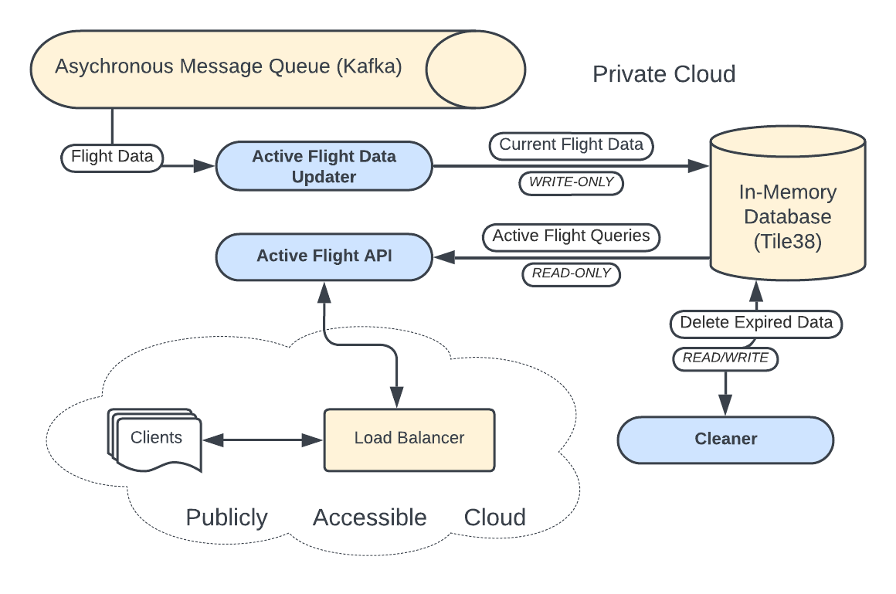

# **Feature 1: Live View of Flights**

The live view of flights presents a view of all currently active flights within the specific bounds of the user's home screen. This is attained by populating an in-memory database, `Tile38` with continual updates on the current position of each flight as we consume them from the `active_flights` topic in our data pipeline. To update `Tile38` with the current position of all active flights, you can leverage its real-time geospatial capabilities to store and track the locations of flights. `Tile38` works by storing geographic objects, such as points, in a spatial index, and allows for efficient real-time updates and queries on those objects. For each flight, you would store the flight's unique ID along with its current latitude and longitude as a geospatial point. To update the flight's position, the **SET** command is used, which updates or adds a new geospatial object for the flight. This can be done as frequently as needed (e.g., every few seconds) to keep the flight locations current.

For example, to update a flight with ID `flight_123` to a new position with latitude `40.730610` and longitude `-73.935242`, you would issue the following command:
```bash
SET active_flights flight_123 POINT 40.730610 -73.935242
```
This command adds or updates the location of `flight_123` in the `active_flights` collection, using a `POINT` object to represent the geospatial coordinates. This operation would be repeated for each flight data message received from the data pipeline. 

To retrieve a set of flights within a geographic bounding box, you can use Tile38’s **WITHIN** command. The bounding box is defined by two sets of coordinates: the southwest corner (min latitude/longitude) and the northeast corner (max latitude/longitude). This command will return all flights whose positions fall within the specified bounding box. For example, if you want to query for all flights within a bounding box that extends from latitude `40.0` to `41.0` and longitude `-74.0` to `-73.0`, you would run the following command:
```bash
WITHIN active_flights BOUNDS 40.0 -74.0 41.0 -73.0
```
This command queries the `active_flights` collection and returns all flight objects whose geospatial points fall within the given bounding box. `Tile38` efficiently handles these queries at low latency, making it suitable for the user experience required for our feature. 

Our data flow architecture is presented below:



## Active Flight Data Update 


## Active Flight API

Here’s an example of how you would use Python to update the flight positions and retrieve flights within a bounding box:


To send the current flight position from a Protobuf message to a Tile38 database using the Python Tile38 library, you first need to deserialize the Protobuf message, extract the relevant data (latitude, longitude, flight ID, altitude, and airspeed), and store this information into Tile38.

### Steps:

1. **Install dependencies:**
   You need the following Python packages:
   - `protobuf` for handling Protobuf messages.
   - `tile38` for interacting with the Tile38 database.

   Install them via pip:
   ```bash
   pip install protobuf tile38
   ```

2. **Define the Protobuf schema:**
   You will generate Python classes from your `.proto` file using the `protoc` compiler. For the sake of simplicity, I will assume you've already compiled your `.proto` file into Python classes.

   If you haven’t done this yet, here’s how:
   ```bash
   protoc --python_out=. your_file.proto
   ```

3. **Write the Python code:**
   Below is an example of how to deserialize the Protobuf message and insert the flight data into a Tile38 database using the Python Tile38 library:


```python
import tile38
from flight_data_pb2 import FlightData

# Initialize Tile38 client
client = tile38.Tile38()

def update_flight(flight_data: FlightData):
    # Store the flight data in Tile38 with altitude, airspeed, and metadata as fields
    # The collection is named `flights`, and each flight is stored with its `flight_id`. Fields like # # # # altitude and airspeed are stored alongside the geospatial data (latitude and longitude).
    client.set('active_flights', flight_data.flight_id).fields(
        altitude=flight_data.altitude,
        airspeed=flight_data.airspeed,
        airline=flight_data.metadata.airline,
        flight_number=flight_data.metadata.flight_number,
        departure_airport=flight_data.metadata.departure_airport,
        arrival_airport=flight_data.metadata.arrival_airport
    ).point(
      flight_data.location.latitude, 
      flight_data.location.longitude
    )
```

To perform a bounding box query of all active flights within a region using the Tile38 Python client, we will need to use the `bounds` query. Tile38 is optimized for high-performance geospatial queries and should scale well with millions of queries per second when deployed appropriately.

Here’s a Python implementation that performs a bounding box query and is optimized for scalability. I'll also explain how to ensure it scales for high throughput scenarios.

### Steps to implement:
1. **Initialize the Tile38 client.**
2. **Define the bounding box query.**
3. **Optimize for performance by batching or sharding queries (depending on the size of your Tile38 cluster).**

### Code Example:

```python
import tile38

# Initialize Tile38 client
client = tile38.Tile38()

def get_active_flights_in_region(min_lat, min_lon, max_lat, max_lon):
    """
    Queries all flights within a bounding box defined by (min_lat, min_lon) and (max_lat, max_lon).
    
    :param min_lat: Minimum latitude (Southwest corner of the bounding box).
    :param min_lon: Minimum longitude (Southwest corner of the bounding box).
    :param max_lat: Maximum latitude (Northeast corner of the bounding box).
    :param max_lon: Maximum longitude (Northeast corner of the bounding box).
    :return: List of flights within the bounding box.
    """
    
    # Perform the bounding box query
    # Queries all flights within the bounding box defined by the minimum and maximum latitude/longitude.

    response = client.within('flights').bounds(min_lat, min_lon, max_lat, max_lon).asObjects()

    # Extract and return flight data from the response
    # method retrieves the result as a list of GeoJSON-like objects, each containing flight data such as
    # coordinates and other stored fields (e.g., altitude, speed).
   
    active_flights = response.get('objects', [])

    print(f"Found {len(active_flights)} active flights in the region.")
    
    # Optionally, you can further process or return the list of active flights
    return active_flights

# Example: Bounding box for a specific region
min_lat = 30.0  # Example: Southwest latitude
min_lon = -120.0  # Example: Southwest longitude
max_lat = 40.0  # Example: Northeast latitude
max_lon = -110.0  # Example: Northeast longitude

# Fetch flights within the bounding box
active_flights = get_active_flights_in_region(min_lat, min_lon, max_lat, max_lon)

# Output example
for flight in active_flights:
    flight_id = flight['id']
    lat = flight['object']['coordinates'][1]
    lon = flight['object']['coordinates'][0]
    print(f"Flight {flight_id} is at location ({lat}, {lon})")
```

The output will be the flight IDs and their respective latitudes and longitudes within the defined bounding box:


This approach will allow you to efficiently query large regions for active flights while leveraging Tile38’s performance optimizations for millions of queries per second.


1. **gRPC Server**: The gRPC server will handle client requests and perform the bounding box query to fetch flights.
2. **WebSocket**: This will send real-time updates to clients as flight data changes.
3. **Integration with Tile38**: Use Tile38’s Pub/Sub to get real-time updates about geospatial objects entering, leaving, or moving within a defined geofence (bounding box).

### Steps to Implement:
1. **Define the gRPC service using `.proto`**: Define a service with a streaming RPC for continuous updates.
2. **Set up a WebSocket server**: This server will broadcast real-time flight data updates.
3. **Listen for updates from Tile38**: Subscribe to Tile38’s real-time geofence notifications for flights moving in and out of the bounding box.


### Stream updates to WebSocket clients


Step 1: Define the gRPC `.proto` File

First, create a `.proto` file for the gRPC service that defines a streaming RPC. We’ll include a `Flight` message for each flight's details and a streaming response for real-time updates.

```proto
syntax = "proto3";

package "flightstream";

service LiveFlightService {
    // Server streaming RPC for flight updates
    rpc StreamActiveFlights (BoundingBox) returns (stream FlightData) {}
}

message BoundingBox {
    double min_latitude = 1;
    double min_longitude = 2;
    double max_latitude = 3;
    double max_longitude = 4;
}

message FlightData {
  // As previously defined
}
```

### Step 2: Implement the gRPC Server with WebSocket Streaming

Below is the Python code to implement the gRPC server using `grpcio` and `websockets` libraries. It subscribes to Tile38’s real-time notifications and streams them to clients via WebSockets.

#### Implement the gRPC server and WebSocket

```python
import tile38
from flightstream_pb2_grpc import FlightServiceServicer 
from flightstream_pb2 import BoundingBox 
from flight_pb2 import FlightData

# Tile38 client
client = tile38.Tile38()

# Async generator to send flight data to the gRPC stream
async def flight_stream(bounding_box: BoundingBox):
    min_lat, min_lon, max_lat, max_lon = bbox

    # Subscribe to Tile38 geofence events
    async for notification in client.within('active_flights')
      .bounds(min_lat, min_lon, max_lat, max_lon)
      .asFence()
      .exec():
        for obj in notification.get('object', []):
            flight_id = obj['id']
            lat = obj['coordinates'][1]
            lon = obj['coordinates'][0]
            altitude = obj.get('fields', {}).get('altitude', 0)
            airspeed = obj.get('fields', {}).get('airspeed', 0)
            timestamp = time.strftime('%Y-%m-%dT%H:%M:%SZ', time.gmtime())

            # Create Flight message to send over gRPC
            flight_data = FlightData(
                flight_id=flight_id,
                latitude=lat,
                longitude=lon,
                altitude=altitude,
                airspeed=airspeed,
                timestamp=timestamp,
                metadata=
            )
            yield flight

class FlightService(flight_pb2_grpc.FlightServiceServicer):
    async def StreamActiveFlights(self, request, context):
        bbox = (request.min_lat, request.min_lon, request.max_lat, request.max_lon)
        async for flight in flight_stream(bbox):
            await context.write(flight)

# Create and start gRPC server
async def serve_grpc():
    server = grpc.aio.server(futures.ThreadPoolExecutor(max_workers=10))
    flight_pb2_grpc.add_FlightServiceServicer_to_server(FlightService(), server)
    server.add_insecure_port('[::]:50051')
    await server.start()
    await server.wait_for_termination()

# WebSocket server to stream flight data
async def websocket_handler(websocket, path):
    # Define the bounding box (can be received via a WebSocket message)
    min_lat, min_lon, max_lat, max_lon = 30.0, -120.0, 40.0, -110.0
    bbox = (min_lat, min_lon, max_lat, max_lon)

    async for flight in flight_stream(bbox):
        # Send flight data over the WebSocket
        await websocket.send(f"Flight {flight.flight_id}: ({flight.latitude}, {flight.longitude}) at {flight.altitude} feet and {flight.airspeed} knots.")

# Start the WebSocket server
async def start_websocket_server():
    async with websockets.serve(websocket_handler, ACTIVE_FLIGHT_DATA_HOST, 6789):
        await asyncio.Future()  # Run forever

# Main event loop to run both gRPC and WebSocket servers concurrently
async def main():
    await asyncio.gather(serve_grpc(), start_websocket_server())

if __name__ == '__main__':
    asyncio.run(main())
```

### Explanation:

1. **gRPC Server**: 
   - We create a `FlightService` with a `StreamActiveFlights` method that listens for bounding box updates and sends flight data back to the client.
   - The `flight_stream` async generator listens for Tile38 geofence notifications for flights within the bounding box and yields each flight update.

2. **WebSocket Server**:
   - A simple WebSocket server streams updates by subscribing to real-time geofence notifications in Tile38.
   - WebSocket clients receive a continuous stream of flight data (flight ID, position, altitude, and airspeed).

3. **Tile38 Integration**:
   - The `asFence()` method listens to geospatial events from Tile38, ensuring real-time updates when flights move into, out of, or change positions within the bounding box.
   - For each notification, we extract the flight data and yield it to the WebSocket and gRPC clients.


### Conclusion:

This implementation opens a WebSocket and gRPC interface for real-time streaming of active flights within a specified bounding box. It integrates with Tile38's geofence and notification system for real-time geospatial updates, ensuring that any flight moving in or out of the bounding box is streamed to the clients instantly.

This setup can be scaled further with sharding, load balancing, or multiple Tile38 instances for larger scale deployments.