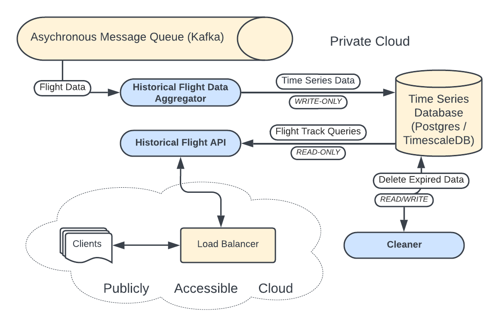

# 4. Feature 2: Time Series Flight Data

The historical flight view feature provides a detailed view of the flight in the form of a time series from the beginning of the flight to its completion (or the current time) and this data is persisted until that flight takes off again on its next journey. To fulfill these data needs, we will need to collect and store this data and optimize it for retrieval. This data includes a timeseries history of the flight's route, including key parameters like location, altitude, and airspeed. This historical data is processed to display both visually on a graph and in metadata format, showing information like airline, flight number, and departure and arrival airports. The historical data aggregator ensures that this data is stored efficiently providing for an efficient and consistent means of retrieval. 



## 4.1 Data model

We will need a schema for the time series data and will choose one that closely matches the `FlightData` protobuf message that we receive from the data pipeline. For efficiency, we can store the metadata separately, and control when and how we update this information since it will not likely change very frequently. 

```sql
-- Create table for time series data
CREATE TABLE flight_data (
    flight_id VARCHAR(12) NOT NULL,
    timestamp TIMESTAMPTZ NOT NULL,
    latitude DOUBLE PRECISION NOT NULL,
    longitude DOUBLE PRECISION NOT NULL,
    altitude INT NOT NULL,
    airspeed INT NOT NULL,

    PRIMARY KEY flight_id
);

-- Create table for metadata
CREATE TABLE flight_metadata (
    flight_id VARCHAR(12) NOT NULL,
    airline TEXT,
    flight_number TEXT,
    departure_airport TEXT,
    arrival_airport TEXT,

    PRIMARY KEY flight_id
);

-- Add TimescaleDB's hypertable functionality
SELECT create_hypertable('flight_data', 'timestamp');
```

Furthermore we will leverage the capabilites of `TimescaleDB` to perform aggregations on this time series data so that we include these statistics in our historical flight data views. 
By leveraging TimescaleDB’s time-series capabilities, we offload the computation of these aggregations to the database, which can optimize performance and scalability. The following give some examples how `TimescaleDB` can help with each of these aggregation functions:

- Average Airspeed Calculation
  TimescaleDB supports continuous aggregations using its **hypertable** and **continuous aggregate** functionality. You can create a continuous aggregate view to automatically compute the average airspeed over time for each flight.

  ```sql
  CREATE VIEW average_airspeed AS
  SELECT
    flight_id,
    time_bucket('1 minute', time) AS bucket,
    AVG(airspeed) AS avg_airspeed
  FROM flight_data
  GROUP BY flight_id, bucket;
  ```

  This would give you the average airspeed for each flight, aggregated in one-minute buckets, and the query results would be automatically updated as new data comes in.


- Maximum Altitude over a Time Window.

  ```sql
  CREATE VIEW max_altitude AS
  SELECT
    flight_id,
    time_bucket('1 minute', time) AS bucket,
    MAX(altitude) AS max_altitude
  FROM flight_data
  GROUP BY flight_id, bucket;
  ```
  This view would provide the maximum altitude for each flight within a specific time bucket.

- Total Distance Traveled

  To calculate the total distance, you can store latitude and longitude as columns and use a custom function in SQL to calculate the distance between points using the **Haversine formula** (or use built-in geospatial extensions like PostGIS). Then you could calculate distances between consecutive points and aggregate them over time:

  ```sql
  WITH distance_calculations AS (
    SELECT
      flight_id,
      time,
      LAG(latitude) OVER (PARTITION BY flight_id ORDER BY time) AS prev_latitude,
      LAG(longitude) OVER (PARTITION BY flight_id ORDER BY time) AS prev_longitude,
      latitude,
      longitude
    FROM flight_data
  )
  SELECT
    flight_id,
    SUM(haversine(prev_latitude, prev_longitude, latitude, longitude)) AS total_distance
  FROM distance_calculations
  WHERE prev_latitude IS NOT NULL AND prev_longitude IS NOT NULL
  GROUP BY flight_id;
  ```

  This query uses `LAG` to get the previous latitude and longitude for each point in the time series and then applies the **Haversine formula** to calculate the distance between consecutive points.


## 4.2. Historical Flight Data Aggregator 

To store flight data into a `TimescaleDB` time-series database using Python, you would first need to translate the protobuf message schema into a corresponding SQL schema for `TimescaleDB`, and then populate the database using a series of `INSERT` statements.

```python
import psycopg2
from google.protobuf.timestamp_pb2 import Timestamp
from flight_data_pb2 import FlightData  # Assuming you have generated the protobuf file

cursor = db_connection.cursor()

def insert_flight_data(flight_data: FlightData):
    # Extract the data from the protobuf message
    flight_id = flight_data.flight_id
    latitude = flight_data.location.latitude
    longitude = flight_data.location.longitude
    altitude = flight_data.altitude
    airspeed = flight_data.airspeed
    # Should be in ISO 8601 or UNIX epoch format
    timestamp = flight_data.timestamp  
    airline = flight_data.metadata.airline
    flight_number = flight_data.metadata.flight_number
    departure_airport = flight_data.metadata.departure_airport
    arrival_airport = flight_data.metadata.arrival_airport

    # Prepare SQL insert query
    query = """
    INSERT INTO flight_data (flight_id, latitude, longitude, altitude, airspeed, timestamp, airline, flight_number, departure_airport, arrival_airport)
    VALUES (%s, %s, %s, %s, %s, %s, %s, %s, %s, %s);
    """

    # Insert the data into the database
    cursor.execute(query, (
        flight_id, latitude, longitude, altitude, airspeed, timestamp, 
        airline, flight_number, departure_airport, arrival_airport
    ))
    db_connection.commit()
```

The data is automatically aggregated and updated by virtue of the `TimescaleDB` extensions. No further activity is required!


## 4.3. Historical Flight Data API

First we need to define protocol definitions for all the data that will be providing. This is tedious, but necessary. 

```proto
syntax = "proto3";

package flighthistory;

message FlightDataRequest {
  string flight_id = 1;
}

message FlightData {
  string flight_id = 1;
  double latitude = 2;
  double longitude = 3;
  int32 altitude = 4;
  int32 airspeed = 5;
  string timestamp = 6;  // ISO 8601 format or UNIX epoch time
  string airline = 7;
  string flight_number = 8;
  string departure_airport = 9;
  string arrival_airport = 10;
}

message FlightDataResponse {
  repeated FlightData flight_data = 1;
}

service FlightDataService {
  rpc GetFlightData(FlightDataRequest) returns (FlightDataResponse);

  // Get the average airspeed for a flight within a time range
  rpc GetAverageAirspeed(AirspeedRequest) returns (AirspeedResponse);

  // Get the maximum altitude for a flight within a time range
  rpc GetMaxAltitude(AltitudeRequest) returns (AltitudeResponse);

  // Get the total distance traveled by a flight
  rpc GetTotalDistance(DistanceRequest) returns (DistanceResponse);

  // Get time spent in a specific altitude range for a flight
  rpc GetTimeInAltitudeRange(AltitudeRangeRequest) returns (TimeInAltitudeRangeResponse);
}

message AirspeedRequest {
  string flight_id = 1;
  string start_time = 2;  // ISO 8601 format
  string end_time = 3;    // ISO 8601 format
}

message AirspeedResponse {
  double avg_airspeed = 1;
}

message AltitudeRequest {
  string flight_id = 1;
  string start_time = 2;
  string end_time = 3;
}

message AltitudeResponse {
  double max_altitude = 1;
}

message DistanceRequest {
  string flight_id = 1;
  string start_time = 2;
  string end_time = 3;
}

message DistanceResponse {
  double total_distance = 1;
}

message AltitudeRangeRequest {
  string flight_id = 1;
  string start_time = 2;
  string end_time = 3;
  double range_start = 4;
  double range_end = 5;
}

message TimeInAltitudeRangeResponse {
  double time_in_range = 1;  // time in seconds
}
```


```python
import grpc
import psycopg2
from flight_data_pb2 import FlightData, FlightDataResponse
from flight_data_pb2_grpc import FlightDataServiceServicer

# Flight Data Service class implementation
class FlightDataService(FlightDataServiceServicer):
    def GetFlightData(self, request, context):
        flight_id = request.flight_id

        try:
            cursor = db_connection.cursor()
            query = """
            SELECT flight_id, latitude, longitude, altitude, airspeed, timestamp, airline, flight_number, departure_airport, arrival_airport
            FROM flight_data
            WHERE flight_id = %s
            ORDER BY timestamp;
            """
            cursor.execute(query, (flight_id,))
            rows = cursor.fetchall()

            if not rows:
                context.set_details("Flight not found")
                context.set_code(grpc.StatusCode.NOT_FOUND)
                return FlightDataResponse()

            flight_data_list = [
                FlightData(
                    flight_id=row[0],
                    latitude=row[1],
                    longitude=row[2],
                    altitude=row[3],
                    airspeed=row[4],
                    timestamp=row[5].isoformat(),  # Assuming timestamp is returned in UTC
                    airline=row[6],
                    flight_number=row[7],
                    departure_airport=row[8],
                    arrival_airport=row[9]
                )
                for row in rows
            ]

            return FlightDataResponse(flight_data=flight_data_list)

        except Exception as e:
            context.set_details(f"Internal error: {str(e)}")
            context.set_code(grpc.StatusCode.INTERNAL)
            return FlightDataResponse()
    
    def GetAverageAirspeed(self, request, context):
        conn = connect_db()
        cursor = conn.cursor()
        query = """
        SELECT AVG(airspeed)
        FROM flight_data
        WHERE flight_id = %s AND time >= %s AND time <= %s;
        """
        cursor.execute(query, (request.flight_id, request.start_time, request.end_time))
        avg_airspeed = cursor.fetchone()[0] or 0
        cursor.close()
        conn.close()
        return flight_data_pb2.AirspeedResponse(avg_airspeed=avg_airspeed)
    
    def GetMaxAltitude(self, request, context):
        conn = connect_db()
        cursor = conn.cursor()
        query = """
        SELECT MAX(altitude)
        FROM flight_data
        WHERE flight_id = %s AND time >= %s AND time <= %s;
        """
        cursor.execute(query, (request.flight_id, request.start_time, request.end_time))
        max_altitude = cursor.fetchone()[0] or 0
        cursor.close()
        conn.close()
        return flight_data_pb2.AltitudeResponse(max_altitude=max_altitude)
    
    def GetTotalDistance(self, request, context):
        conn = connect_db()
        cursor = conn.cursor()
        query = """
        WITH distance_calculations AS (
          SELECT
            time,
            LAG(latitude) OVER (ORDER BY time) AS prev_latitude,
            LAG(longitude) OVER (ORDER BY time) AS prev_longitude,
            latitude,
            longitude
          FROM flight_data
          WHERE flight_id = %s AND time >= %s AND time <= %s
        )
        SELECT SUM(haversine(prev_latitude, prev_longitude, latitude, longitude))
        FROM distance_calculations
        WHERE prev_latitude IS NOT NULL AND prev_longitude IS NOT NULL;
        """
        cursor.execute(query, (request.flight_id, request.start_time, request.end_time))
        total_distance = cursor.fetchone()[0] or 0
        cursor.close()
        conn.close()
        return flight_data_pb2.DistanceResponse(total_distance=total_distance)
    
```

## 4.4. Cleaner

Obviously this data will need to be cleaned up. 